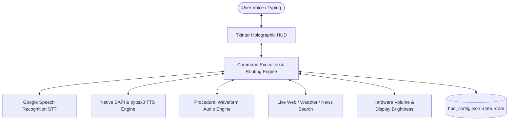

# Software Requirements Specification (SRS)

## J.A.R.V.I.S Holographic AI Voice Assistant & Neural Workstation

**Document Version:** 3.8  
**Standard:** IEEE Std 830-1998 / ISO/IEC/IEEE 29148:2018 Compliant  
**Status:** Approved / Production Baseline  
**Date:** September 2026  

---

## Table of Contents

1. [Introduction](#1-introduction)
   - 1.1 [Purpose](#11-purpose)
   - 1.2 [Document Conventions](#12-document-conventions)
   - 1.3 [Intended Audience and Reading Suggestions](#13-intended-audience-and-reading-suggestions)
   - 1.4 [Project Scope](#14-project-scope)
   - 1.5 [References](#15-references)
2. [Overall Description](#2-overall-description)
   - 2.1 [Product Perspective](#21-product-perspective)
   - 2.2 [Product Functions Summary](#22-product-functions-summary)
   - 2.3 [User Classes and Characteristics](#23-user-classes-and-characteristics)
   - 2.4 [Operating Environment](#24-operating-environment)
   - 2.5 [Design and Implementation Constraints](#25-design-and-implementation-constraints)
   - 2.6 [Assumptions and Dependencies](#26-assumptions-and-dependencies)
3. [External Interface Requirements](#3-external-interface-requirements)
   - 3.1 [User Interfaces (GUI & HUD)](#31-user-interfaces-gui--hud)
   - 3.2 [Hardware Interfaces](#32-hardware-interfaces)
   - 3.3 [Software & API Interfaces](#33-software--api-interfaces)
   - 3.4 [Communications Interfaces](#34-communications-interfaces)
4. [System Features & Functional Requirements](#4-system-features--functional-requirements)
   - 4.1 [Speech Recognition & Audio Ingestion](#41-speech-recognition--audio-ingestion)
   - 4.2 [Dual-Engine Text-to-Speech (TTS) & Voice Switching](#42-dual-engine-text-to-speech-tts--voice-switching)
   - 4.3 [Procedural Cybernetic Audio Effects (SFX) Engine](#43-procedural-cybernetic-audio-effects-sfx-engine)
   - 4.4 [Web Intelligence & Verified Search Retrieval](#44-web-intelligence--verified-search-retrieval)
   - 4.5 [Universal YouTube Video Discovery & Direct Playback Engine](#45-universal-youtube-video-discovery--direct-playback-engine)
   - 4.6 [Meteorological Satellite Telemetry (wttr.in)](#46-meteorological-satellite-telemetry-wttrin)
   - 4.7 [Global News RSS Intelligence Feed](#47-global-news-rss-intelligence-feed)
   - 4.8 [Hardware Control (Volume & Display Brightness)](#48-hardware-control-volume--display-brightness)
   - 4.9 [Chronometer & 12-Hour Time Telemetry](#49-chronometer--12-hour-time-telemetry)
   - 4.10 [Voice & Audio Lab Modal Dialog](#410-voice--audio-lab-modal-dialog)
   - 4.11 [Customizer Drawer & Modular Layout Reconfiguration](#411-customizer-drawer--modular-layout-reconfiguration)
   - 4.12 [Theme Morpher & Visual Customization](#412-theme-morpher--visual-customization)
   - 4.13 [Persistent Configuration Management](#413-persistent-configuration-management)
   - 4.14 [Bilingual Hindi and English Language Engine](#414-bilingual-hindi-and-english-language-engine)
   - 4.15 [Spotify Music Streaming Engine](#415-spotify-music-streaming-engine)
   - 4.16 [AI Neural Model Engine, Precision Math and Comparative Intelligence](#416-ai-neural-model-engine-precision-math-and-comparative-intelligence)
5. [Non-Functional Requirements](#5-non-functional-requirements)
   - 5.1 [Performance Requirements](#51-performance-requirements)
   - 5.2 [Reliability & Fault Tolerance](#52-reliability--fault-tolerance)
   - 5.3 [Security & Privacy](#53-security--privacy)
   - 5.4 [Maintainability & Extensibility](#54-maintainability--extensibility)
   - 5.5 [Portability](#55-portability)
6. [Verification & Traceability Matrix](#6-verification--traceability-matrix)

---

## 1. Introduction

### 1.1 Purpose

This Software Requirements Specification (SRS) document provides a complete and definitive specification for the **J.A.R.V.I.S Holographic AI Voice Assistant & Neural Workstation (v3.8)**. It defines the functional and non-functional requirements, external interfaces, system behaviors, architecture constraints, and verification procedures for developers, maintainers, testers, and stakeholders.

### 1.2 Document Conventions

- **IEEE Std 830-1998**: Conforms to standard SRS organizational structures.
- **Requirement Identifiers**:
  - `REQ-FR-xxx`: Functional Requirement
  - `REQ-UI-xxx`: User Interface Requirement
  - `REQ-NFR-xxx`: Non-Functional Requirement
  - `REQ-EXT-xxx`: External Interface Requirement
- **Priority Ratings**:
  - `[High]`: Essential core capabilities required for operation.
  - `[Medium]`: High-value usability and customization capabilities.
  - `[Low]`: Aesthetic enhancements and optional modular extensions.

### 1.3 Intended Audience and Reading Suggestions

- **Developers & Engineers**: Focus on Sections 3, 4, and 5 to understand architectural requirements, API integration, and thread management.
- **Quality Assurance & Testers**: Focus on Section 4 and Section 6 for verification matrix, boundary conditions, and acceptance criteria.
- **End Users / Stakeholders**: Focus on Section 2 for product capabilities, workflows, and operating environments.

### 1.4 Project Scope

J.A.R.V.I.S is a desktop-native cognitive voice assistant designed for Windows environments. It bridges human speech with workstation telemetry, real-time Internet intelligence, hardware management, media automation, and cinematic holographic user interfaces. The system operates without paid third-party API keys, utilizing open standards, procedural signal synthesis, and native Windows COM automation.

### 1.5 References

1. IEEE Std 830-1998: *Recommended Practice for Software Requirements Specifications*.
2. Microsoft Speech API (SAPI 5.4): *Automation Interfaces and Voice Tokens Specification*.
3. Python 3.10+ Standard Library: `wave`, `struct`, `winsound`, `threading`, `queue`, `json`.
4. W3C XML 1.0 & RSS 2.0 Feed Specifications.

---

## 2. Overall Description

### 2.1 Product Perspective

J.A.R.V.I.S is an autonomous, standalone desktop software system deployed on user workstations. It functions as an intelligent interface layer atop Windows 10/11:



### 2.2 Product Functions Summary

- **Conversational AI Core**: Natural intent-matching for standard conversational inquiries and assistant persona queries.
- **Real-Time Web Intelligence**: DuckDuckGo, Wikipedia, and Google News aggregation with guaranteed truthfulness (no hallucinations or guessing).
- **Meteorological Satellite Telemetry**: Real-time atmospheric forecasts via wttr.in for India and international cities.
- **Smart YouTube Direct Autoplay**: Background scraping of YouTube video IDs and automated browser playback dispatch.
- **Complete Output Speech Reading**: Automatic voice narration of generated answers with sentence chunking and symbol expansion.
- **Dynamic Voice-Over Personas**: Live switching between J.A.R.V.I.S (David - Tactical Male) and F.R.I.D.A.Y (Zira - Neural Female) or any installed system voices.
- **Procedural Cybernetic Audio SFX**: Self-synthesizing 44.1kHz sci-fi sound effects suite integrated into all workstation operations.
- **Workstation Hardware Control**: Display brightness control (0–100%) and system volume adjustment (up, down, mute).
- **Chronometer & 12-Hour Telemetry**: Real-time 12-hour AM/PM chronometer with terminal synchronization.
- **Holographic 3-Panel HUD**: Animated Arc Reactor, canvas audio waveform, live terminal feed, and matrix data rain.
- **Modular HUD Customization**: Interactive drawer for panel reordering, module toggles, theme switching, and custom shortcut buttons.

### 2.3 User Classes and Characteristics

- **General End-Users**: Require hands-free voice automation for daily computer tasks, weather checks, music playback, and web search.
- **Power Users / Tech Enthusiasts**: Desire a high-tech sci-fi workstation dashboard with customizable layouts, soundboard testing, and speed modulation.
- **Accessibility Seekers**: Require loud, clear speech readout of terminal outputs and high-contrast color palettes.

### 2.4 Operating Environment

- **Operating System**: Microsoft Windows 10 (64-bit) or Windows 11 (64-bit).
- **Python Runtime**: Python 3.8, 3.9, 3.10, 3.11, or 3.12.
- **Display Resolution**: 1160x800 minimum recommended (responsive minimum 960x700).
- **Network**: Broadband internet connection for real-time web search and speech recognition.
- **Audio Hardware**: Standard microphone input and stereo audio output device.

### 2.5 Design and Implementation Constraints

- **Zero External Audio Dependencies**: All sound effects must be procedurally generated via Python's standard `wave` and `struct` modules without requiring external media binaries or ffmpeg.
- **Thread Isolation**: The Tkinter GUI must never freeze during network requests, speech recognition, or audio playback. All blocking operations must execute in dedicated worker daemon threads.
- **COM Apartment Concurrency**: Microsoft SAPI SpVoice COM objects must be initialized and accessed exclusively within their designated Single-Threaded Apartment (STA) thread.
- **No Paid API Keys**: System features must rely on open endpoints, public RSS feeds, and standard scraping protocols.

### 2.6 Assumptions and Dependencies

- Windows default audio output endpoint is active and unmuted at the OS level.
- Windows SAPI voices (`Microsoft David Desktop` and/or `Microsoft Zira Desktop`) are present in standard Windows installations.
- Network access allows HTTP/HTTPS connections to Google, DuckDuckGo, wttr.in, and Wikipedia.

---

## 3. External Interface Requirements

### 3.1 User Interfaces (GUI & HUD)

- **REQ-UI-001 [High]**: The interface shall render a 3-panel responsive layout:
  - **Left Panel (`lp`)**: Holographic animated Arc Reactor, core diagnostic telemetry, and Voice Capture activation trigger.
  - **Center Panel (`cp`)**: Telemetry terminal, real-time audio waveform canvas, quick access deck, and hardware sliders.
  - **Right Panel (`rp`)**: Interactive, real-time core-reactive cybernetic matrix data system with multi-mode telemetry stream (Core / Neural / Vox / Hex), interactive EMP shockwaves, targeting crosshair hover inspect, speed scaling, and live measured 60 FPS monitor.
- **REQ-UI-002 [Medium]**: The interface shall provide a **Voice & Audio Lab** modal containing voice selection cards, preview auditioning buttons, rate sliders, and an interactive 7-sound effect soundboard.
- **REQ-UI-003 [Medium]**: The interface shall support 5 curated sci-fi themes: Cyber Cyan (J.A.R.V.I.S), Matrix Neon (Hacker HUD), Solar Amber (War Machine), Quantum Purple (Nebula), and Crimson Red (Mark 85 Alert).
- **REQ-UI-004 [High]**: All logs and digital clocks must display timestamps formatted in 12-hour chronometer notation (`hh:mm:ss AM/PM`).
- **REQ-UI-005 [High]**: **Interactive Real-Time Matrix Data System**: The matrix data stream shall actively react to voice assistant core states in real-time (Neon Green during mic capture, Golden Amber during AI/intent processing, Neon Cyan during speech synthesis), stream live hardware telemetry (CPU, RAM, network) and query tokens, provide interactive mouse hover targeting crosshairs with localized character decryption, support click-triggered expanding EMP shockwaves, and provide on-HUD mode and speed toggles.

### 3.2 Hardware Interfaces

- **REQ-HW-001 [High]**: **Audio Microphone**: Input captured via `speech_recognition.Microphone()` with startup background ambient noise pre-calibration (`_precalibrate_microphone()`) and fast runtime micro-calibration (0.08s).
- **REQ-HW-002 [High]**: **Audio Output**: Playback rendered through Windows Multimedia endpoint via `winsound.PlaySound` and DirectSound/WASAPI via SAPI.
- **REQ-HW-003 [High]**: **Display Backlight**: Integrated display brightness modulated via `screen_brightness_control`.
- **REQ-HW-004 [High]**: **System Audio Mixer**: Master volume adjusted via Windows native keycode simulation (`ctypes.windll.user32.keybd_event`).

### 3.3 Software & API Interfaces

- **REQ-SW-001 [High]**: **Windows SAPI (`win32com.client`)**: Primary speech synthesizer using `SAPI.SpVoice` automation token.
- **REQ-SW-002 [High]**: **Google Speech Recognition Service**: Converts ingested audio buffers into text using Indian English (`en-IN`) and Hindi (`hi-IN`) dialects with concurrent multi-dialect resolution.
- **REQ-SW-003 [High]**: **wttr.in Meteorological Service**: Fetches formatted atmospheric telemetry (`format=j1`) over HTTPS.
- **REQ-SW-004 [High]**: **Google News RSS Feed**: Fetches real-time XML news dispatches for general, technology, business, and sports topics.
- **REQ-SW-005 [High]**: **DuckDuckGo Instant Answer API**: Fetches structured encyclopedic abstracts without user tracking.
- **REQ-SW-006 [High]**: **Wikipedia API**: Extracts verified summaries and biographies.

### 3.4 Communications Interfaces

- **REQ-COMM-001 [High]**: All outbound web requests shall utilize HTTPS via standard TLS 1.2 / 1.3 encryption.
- **REQ-COMM-002 [High]**: Network requests shall have strict timeouts (maximum 6.0 seconds) to prevent application hangs during connection degradation.

---

## 4. System Features & Functional Requirements

### 4.1 Speech Recognition & Audio Ingestion

- **REQ-FR-001 [High]**: The system shall initiate voice capture when the user clicks `START LISTENING` or triggers a voice capture event.
- **REQ-FR-002 [Medium]**: The system shall play an acoustic sonar ping (`sfx/sonar.wav`) immediately upon opening the microphone channel.
- **REQ-FR-003 [High]**: If speech is not detected within the configured timeout window (default 10.0 seconds, configurable via Voice Lab or voice directives) (`WaitTimeoutError`), the system shall play `sfx/alert.wav` and report timeout status.
- **REQ-FR-004 [High]**: If speech pattern is unrecognizable (`UnknownValueError`), the system shall play `sfx/alert.wav` and report "SPEECH PATTERN UNRECOGNIZED".
- **REQ-FR-053 [High]**: **Intelligent Voice Command Normalizer & Intent Sanitizer**:
  - The voice intake pipeline shall pass raw recognized speech through `normalize_voice_command()` prior to intent routing and handler execution.
  - Multi-pass sanitization shall strip conversational padding prefixes (*"please"*, *"can you please tell me"*, *"could you tell me"*, *"would you kindly"*, *"i want you to"*, *"kripya"*, *"kripaya"*, *"zara batao"*, *"कृपया मुझे बताओ"*), stray repeated wake words (*"Hey Jarvis"*, *"Jarvis"*), trailing politeness (*"thank you"*, *"thanks"*, *"dhanyawad"*), and spoken punctuation artifacts (*"question mark"*, *"full stop"*, *"period"*, *"exclamation mark"*).
  - Sanitized queries shall be propagated directly to downstream computational modules (Math evaluation, Weather telemetry, Spotify, YouTube discovery, Website navigation, System controls) while preserving original spoken transcripts for HUD visual logs.

### 4.2 Dual-Engine Text-to-Speech (TTS) & Voice Switching

- **REQ-FR-005 [High]**: The system shall implement a persistent singleton worker thread (`_tts_daemon_loop`) reading from a thread-safe FIFO queue (`_tts_queue`).
- **REQ-FR-006 [High]**: The system shall dynamically enumerate all installed Windows speech voices on startup.
- **REQ-FR-007 [High]**: The system shall support switching voice profiles dynamically between:
  - J.A.R.V.I.S Tactical Core (`Microsoft David Desktop` - Male)
  - F.R.I.D.A.Y Neural Core (`Microsoft Zira Desktop` - Female)
  - Third-party installed SAPI voices.
- **REQ-FR-008 [High]**: Voice switching shall be triggered by:
  - Voice/Text commands: *"change voice"*, *"switch to female voice"*, *"switch to male voice"*, *"switch to friday"*, *"switch to jarvis"*, *"voice zira"*, *"voice david"*.
  - Voice & Audio Lab modal selection cards.
- **REQ-FR-009 [High]**: The system shall support voice auditioning without altering saved preferences via `("AUDITION_VOICE", idx, text)` directives.
- **REQ-FR-010 [High]**: The system shall clean and expand symbols (`deg C` -> `degrees Celsius`, `km/h` -> `kilometers per hour`, `%` -> `percent`, `[01]` -> `Headline 1:`) before speaking.
- **REQ-FR-011 [High]**: Long text responses shall be chunked into sentences (`(?<=[.!?])\s+`) to guarantee that outputs are read completely without truncation caps.

### 4.3 Procedural Cybernetic Audio Effects (SFX) Engine

- **REQ-FR-012 [High]**: The system shall self-generate 7 high-fidelity 44.1kHz sci-fi audio effects into `sfx/` on startup if missing:
  1. `sfx/boot.wav`: Multi-tone cinematic power-up chord with sub-bass sweep (0.95s).
  2. `sfx/transmit.wav`: Digital command frequency chirp (0.20s).
  3. `sfx/sonar.wav`: Submarine acoustic capture sonar ping with echo (0.65s).
  4. `sfx/downlink.wav`: 4-note ascending bell telemetry decrypted chime (0.82s).
  5. `sfx/switch.wav`: Futuristic frequency morph sweep (0.32s).
  6. `sfx/ack.wav`: Crisp tactile dual-tone feedback click (0.10s).
  7. `sfx/alert.wav`: Dual-pulse holographic attention alert (0.45s).
- **REQ-FR-013 [High]**: Audio effects playback shall be asynchronous (`winsound.SND_ASYNC`) and non-blocking.
- **REQ-FR-014 [Medium]**: The user shall be able to mute/unmute the entire SFX suite via voice commands (*"enable sound effects"*, *"disable sound effects"*) or modal toggle.

### 4.4 Web Intelligence & Verified Search Retrieval

- **REQ-FR-015 [High]**: The system shall evaluate queries to distinguish between conversational intents, factual knowledge lookups, and workstation commands.
- **REQ-FR-016 [High]**: Factual queries shall query DuckDuckGo, Wikipedia, and Google News dispatches.
- **REQ-FR-017 [High]**: **Truthfulness Guarantee**: If no verified data is retrieved, the assistant shall truthfully state that verified intelligence is unavailable rather than fabricating information.
- **REQ-FR-018 [High]**: Every generated search result shall automatically trigger `play_sfx("downlink")`, typewriter display, and complete voice reading.

### 4.5 Universal YouTube Video Discovery & Direct Playback Engine

- **REQ-FR-019 [High]**: The system shall process commands requesting any video across YouTube (tutorials, courses, movie clips, documentaries, music, reviews) in English, Hindi, and Hinglish.
- **REQ-FR-020 [High]**: The system shall parse `ytInitialData` JSON from YouTube search results to extract verified video metadata: exact video title, channel/creator name, duration, and the 11-character video ID.
- **REQ-FR-021 [High]**: The system shall display rich video intelligence telemetry on the HUD typewriter terminal, speak the video title and creator verbally in the query's language, and launch direct browser video playback at `https://www.youtube.com/watch?v=[ID]`.

### 4.6 Meteorological Satellite Telemetry (wttr.in)

- **REQ-FR-022 [High]**: The system shall support meteorological queries (*"what is the weather"*, *"weather in [city]"*).
- **REQ-FR-023 [High]**: Default location shall initialize to `"India"` and be dynamically configurable via *"set default location to [City]"*.
- **REQ-FR-024 [High]**: The system shall report temperature (°C/°F), conditions, feels-like, humidity, wind velocity (km/h), UV index, and visibility (km).

### 4.7 Global News RSS Intelligence Feed

- **REQ-FR-025 [High]**: The system shall parse Google News RSS feeds for general, technology, business, and sports queries.
- **REQ-FR-026 [High]**: The system shall format the top 4 headlines with publication sources and read them sequentially.

### 4.8 Hardware Control (Volume & Display Brightness)

- **REQ-FR-027 [High]**: Voice commands *"volume up"*, *"volume down"*, and *"mute"* shall adjust Windows master audio and play `sfx/ack.wav`.
- **REQ-FR-028 [High]**: Voice commands *"increase brightness"*, *"decrease brightness"*, and *"set brightness [N]"* shall adjust monitor brightness and play `sfx/ack.wav`.

### 4.9 Chronometer & 12-Hour Time Telemetry

- **REQ-FR-029 [High]**: Queries for time shall display and speak the time in 12-hour format (`hh:mm:ss AM/PM`) along with full calendar date.
- **REQ-FR-030 [High]**: HUD digital clock in header shall tick continuously in 12-hour format.

### 4.10 Voice & Audio Lab Modal Dialog

- **REQ-FR-031 [High]**: Accessible via top header toolbar button `[🎙️ VOICE & AUDIO LAB]`.
- **REQ-FR-032 [High]**: Displays interactive voice cards with `[✓ ACTIVE CURRENT]` and `[STANDBY]` badges.
- **REQ-FR-033 [High]**: Provides speech rate buttons (150, 175, 200, 230 WPM).
- **REQ-FR-034 [High]**: Provides an interactive soundboard with trigger buttons for all 7 SFX.

### 4.11 Customizer Drawer & Modular Layout Reconfiguration

- **REQ-FR-035 [Medium]**: Toggled via `[⚡ CUSTOMIZE HUD]` button.
- **REQ-FR-036 [Medium]**: Enables left/right shifting of side panels and up/down reordering of center submodules.
- **REQ-FR-037 [Medium]**: Includes a 6-card Quick Shortcut editor modal for customized prompt buttons.

### 4.12 Theme Morpher & Visual Customization

- **REQ-FR-038 [Medium]**: Dynamically updates HUD canvas strokes, borders, glows, and text tags across all 5 color themes without restarting.

### 4.13 Persistent Configuration Management

- **REQ-FR-039 [High]**: All user preferences shall be persisted in `hud_config.json`:

  ```json
  {
    "theme": "cyan",
    "input_language": "auto",
    "default_location": "Uttar Pradesh, India",
    "column_order": ["lp", "cp", "rp"],
    "center_order": ["term", "wave", "quick", "hardware"],
    "voice_rate": 175,
    "voice_index": 0,
    "voice_name": "Microsoft David Desktop - English (United States)",
    "tts_engine": "sapi",
    "wake_word_enabled": true,
    "sfx_enabled": true,
    "visible": { "lp": true, "cp": true, "rp": true },
    "quick_cmds": [ ... ]
  }
  ```

### 4.14 Bilingual Hindi and English Language Engine

- **REQ-FR-040 [High]**: **Multilingual Audio Ingestion**: The system shall support three selectable speech-to-text recognition modes:
  - `auto`: Concurrently queries Indian English (`en-IN`) and Hindi (`hi-IN`) Google Speech API endpoints via `ThreadPoolExecutor(max_workers=2)` for sub-second dual recognition without language lag.
  - `hi`: Exclusively recognizes Hindi audio input (`hi-IN`).
  - `en`: Exclusively recognizes Indian English audio input (`en-IN`).
- **REQ-FR-041 [High]**: **Devanagari & Hinglish Intent Engine**: The system shall process commands expressed in Devanagari script, Romanized Hinglish, and English across all supported domains:
  - *Chronometer & Time*: "समय क्या हुआ है", "kitne baje hain", "what is the time".
  - *Meteorological Telemetry*: "मौसम बताओ", "delhi me mausam kaisa hai", "weather in London".
  - *Satellite News*: "ताज़ा समाचार", "khabar sunao", "latest news".
  - *YouTube Autoplay*: "यूट्यूब पर केसरिया गाना चलाओ", "chalao Believer", "play Shape of You on YouTube".
  - *Universal Web Navigation*: "गूगल खोलो", "यूट्यूब खोलो", "open GitHub".
  - *Hardware & Audio*: "आवाज बढ़ाओ", "aawaz kam karo", "volume up", "ब्राइटनेस बढ़ाओ".
  - *Conversational & AI Intelligence*: "नमस्ते", "kaise ho", "tum kaun ho", "who are you".
  - *Wikipedia Intelligence*: Official Hindi Wikipedia archive search (`hi.wikipedia.org`) with summary extraction.
- **REQ-FR-043 [High]**: **HUD & Modal Language Controls**: The system shall provide an interactive `[🌐 LANG: DUAL (HI/EN)]` toggle button in the HUD left panel and a dedicated language mode section in the Voice & Audio Lab modal, allowing instant switching between Dual Auto, Hindi Exclusive, and English Exclusive modes.

### 4.15 Spotify Music Streaming Engine

- **REQ-FR-044 [High]**: **Spotify Media Dispatch**: The system shall process commands to stream songs, artists, albums, or playlists on Spotify in English (*"play [song] on spotify"*, *"spotify play [artist]"*) and Hindi/Hinglish (*"स्पॉटिफ़ाई पर [गाना] चलाओ"*, *"spotify par [song] bajao"*).
- **REQ-FR-045 [High]**: **Dual Desktop & Web Launch**: The system shall trigger the native Windows Spotify desktop application URI (`spotify:search:[query]`), with automatic graceful fallback to the Spotify Web Player (`https://open.spotify.com/search/[query]`).
- **REQ-FR-046 [High]**: **Telemetry & Verbal Confirmation**: Every Spotify dispatch shall feed a dedicated `SPOTIFY` intelligence telemetry card into the HUD terminal and deliver spoken confirmation in the user's spoken language.

### 4.16 AI Neural Model Engine, Precision Math and Comparative Intelligence

- **REQ-FR-047 [High]**: **Precision Mathematical Engine**: The system shall evaluate arithmetic, percentage, root, power, and algebraic expressions computationally without delegating to generic web search, outputting dedicated calculation telemetry on the HUD and spoken results.
- **REQ-FR-048 [High]**: **AI Neural Model Core**: The system shall support pluggable AI LLM inference across Groq Cloud (Llama 3.3 70B), Google Gemini (Gemini 2.0 Flash), OpenAI (GPT-4o-mini), and Local Ollama, with automated provider detection and API key persistence in `hud_config.json`.
- **REQ-FR-049 [High]**: **Multi-Entity Comparative Synthesizer**: The system shall parse dual-entity comparison queries (e.g. *"difference between X and Y"*, *"compare X with Y"*, *"X aur Y me kya antar hai"*), retrieve comprehensive extracts for both subjects, and generate structured side-by-side comparison telemetry.
- **REQ-FR-050 [High]**: **Deep Encyclopedic Knowledge Retrieval**: The system shall retrieve multi-paragraph lead sections via Wikipedia's `action=query&prop=extracts&explaintext=1&exintro=1` in both English and Hindi, scored by acronym and token intersection to eliminate false matches.

### 4.17 Hands-Free Ambient Wake-Word Engine

- **REQ-FR-051 [High]**: **Ambient Wake-Word Calling & Immediate Voice Command Capture**:
  - The system shall run a non-blocking background daemon thread (`_wake_word_daemon`) listening for ambient calls of "Jarvis", "Hey Jarvis", "OK Jarvis", "जार्विस", or "सुनो जार्विस" when idle.
  - When invoked, the assistant shall trigger visual ripple telemetry, set status `◉ WAKE ACTIVATED // YES SIR`, and greet aloud:
    - In English: *"Yes sir, how do I help you?"*
    - In Hindi: *"हाँ महोदय, मैं आपकी क्या सहायता कर सकता हूँ?"*
  - The greeting shall complete synchronously via `speak(greeting, block=True)` in a worker thread to prevent mic self-echo, and immediately launch voice command capture (`run_mic_capture_async()`) hands-free.
  - Compound utterances (e.g. *"Jarvis what is the weather"*, *"Hey Jarvis play Believer on YouTube"*) shall automatically strip the wake-word prefix and execute immediately.
  - The system shall provide an interactive HUD toggle button `[ 👂 WAKE: ON (HEY JARVIS) ]` on the left panel and voice commands (*"enable wake word"*, *"disable wake word"*).
- **REQ-FR-052 [High]**: **Command Preemption & Termination on New Invocation**:
  - If a command is actively executing (network queries, AI inference, mathematical computation) or actively speaking via TTS:
  - When the user calls "Jarvis" / "Hey Jarvis" or initiates a new voice or text command, the system shall immediately terminate the previous command via `terminate_previous_command()`.
  - Termination shall:
    1. Increment `_current_command_id` inside `_command_lock`, causing any pending worker threads from the previous command to immediately drop their results and abort execution without updating the UI or speaking.
    2. Instantly halt active audio and TTS output via SAPI COM / pyttsx3 purges (`stop_speaking(flush_queue=True)`).
    3. Flush all pending typewriter characters from `_stream_queue`.
    4. Reset processing and speaking animation flags.
  - The assistant shall execute the new command and deliver full telemetry and spoken output according to the new command.
  - The system shall also support immediate explicit stop commands (*"stop"*, *"cancel"*, *"terminate"*, *"quiet"*, *"रुको"*, *"चुप रहो"*) to halt all ongoing tasks on demand.

---

## 5. Non-Functional Requirements

### 5.1 Performance Requirements

- **REQ-NFR-001 [High]**: **UI Responsiveness & 60 FPS Engine**: GUI animations (Arc Reactor, Waveform, Data Rain, Background Particles, Border Glow) shall render at a rock-solid, stable ~60 FPS (16.6ms frame target) without stutter or frame drops, achieved through Windows multimedia timer calibration (`timeBeginPeriod(1)`), dynamic millisecond work-interval compensation, and frame-rate-independent delta-time (`dt`) physics.
- **REQ-NFR-002 [High]**: **Command Dispatch Latency**: Local commands (volume, brightness, time, voice switch) shall execute within < 150 milliseconds.
- **REQ-NFR-003 [High]**: **Speech Playback Latency**: TTS queue ingestion to audio speaker output shall commence within < 200 milliseconds.
- **REQ-NFR-004 [Medium]**: **Memory Footprint**: Working set memory shall not exceed 150 MB during continuous operation.
- **REQ-NFR-013 [High]**: **Acoustic Calibration & Anti-Truncation Voice Capture**: The voice intake pipeline shall employ a calibrated `pause_threshold = 0.65s` to balance rapid turn-around with total protection against premature mid-sentence cutting when pausing between words. Onset speech shall trigger within 150ms (`phrase_threshold = 0.15s`), and trailing consonant phonemes shall be preserved with `non_speaking_duration = 0.35s`. Capture duration parameters shall provide a generous default 10.0-second listening timeout (`voice_input_timeout`) and 20.0-second phrase time limit (`voice_phrase_time_limit`), dynamically adjustable via Voice Lab or voice directives.
- **REQ-NFR-014 [High]**: **Resilient Multilingual Speech Analysis Race**: In dual bilingual recognition mode (`auto`), the engine shall race Indian English (`en-IN`) and Hindi (`hi-IN`) concurrently via `as_completed(timeout=5.0)`. The pipeline shall catch `concurrent.futures.TimeoutError` gracefully, execute early-exit lexical heuristics upon first valid domain match, and fall back to US English (`en-US`) if regional endpoints yield empty transcripts.
- **REQ-NFR-015 [High]**: **Instant Local Intent Routing**: Instant computational intents (Precision Math evaluation `< 1ms` and Conversational Dialogue `< 1ms`) shall be resolved at the immediate top of `execute_command_thread()`, bypassing external search and network pipelines for instant user response.
- **REQ-NFR-016 [High]**: **Far-Field Digital Audio Pre-Amp, DC Centering & Soft-Knee AGC**: The audio pre-processor (`normalize_and_boost_audio()`) shall eliminate microphone DC bias offset (`abs(dc_bias) > 25`), compute true RMS energy driving `_anim["core_audio_level"]` for live UI waveform reactivity, and apply soft-knee dynamic gain (up to 6.5x / +15.5 dB) to normalize soft and distant voices while protecting absolute silence from noise-floor amplification.

### 5.2 Reliability & Fault Tolerance

- **REQ-NFR-005 [High]**: **Thread Safety**: Any background worker updating GUI widgets must use `_safe_ui_update()` to prevent `RuntimeError: main thread is not in main loop`.
- **REQ-NFR-006 [High]**: **Engine Failover**: If native Windows SAPI COM fails to initialize, the system shall automatically fall back to `pyttsx3`.
- **REQ-NFR-007 [High]**: **Self-Healing Assets**: If any `.wav` file in `sfx/` is corrupted or deleted, the system shall automatically regenerate it on startup.

### 5.3 Security & Privacy

- **REQ-NFR-008 [High]**: Audio captured from the microphone shall be processed exclusively in volatile memory and never saved to persistent disk.
- **REQ-NFR-009 [High]**: System configuration shall store no sensitive credentials or telemetry tracking data.

### 5.4 Maintainability & Extensibility

- **REQ-NFR-010 [Medium]**: The architecture shall allow adding new custom voice commands simply by adding routing branches in `execute_command_thread()`.
- **REQ-NFR-011 [Medium]**: All configuration settings shall adhere to standard human-readable JSON.

### 5.5 Portability

- **REQ-NFR-012 [High]**: The application launcher (`master.py`) shall verify and install all dependencies automatically from `requirements.txt` upon execution.

---

## 6. Verification & Traceability Matrix

| Requirement ID | Requirement Description | Verification Method | Acceptance Criteria | Status |
| :--- | :--- | :--- | :--- | :--- |
| `REQ-FR-001` | Voice Capture Activation | Manual Test | Clicking mic button triggers listening state | ✅ Verified |
| `REQ-FR-006` | Dynamic Voice Enumeration | Automated Unit Test | `get_available_voices()` returns installed voices | ✅ Verified |
| `REQ-FR-007` | Voice Personality Switch | Manual & Automated | David (Male) and Zira (Female) switch correctly | ✅ Verified |
| `REQ-FR-011` | Complete Output Reading | Automated Stress Test | Multi-sentence answers read completely aloud | ✅ Verified |
| `REQ-FR-012` | 7 Procedural SFX Waves | Automated Wave Validation | All 7 `.wav` files valid 44.1kHz audio | ✅ Verified |
| `REQ-FR-013` | Non-blocking Audio SFX | Playback Benchmark | Audio plays without GUI freeze | ✅ Verified |
| `REQ-FR-020` | YouTube Direct Autoplay | Integration Test | Video opens directly in browser with playback | ✅ Verified |
| `REQ-FR-023` | Default Location Config | Integration Test | Set default location to "Delhi" updates config | ✅ Verified |
| `REQ-FR-029` | 12-Hour Chronometer | Unit Test | Clock and voice output format matches `hh:mm AM/PM` | ✅ Verified |
| `REQ-FR-031` | Voice & Audio Lab Modal | GUI Test | Modal opens with cards, soundboard, and sliders | ✅ Verified |
| `REQ-FR-039` | Config File Persistence | File IO Test | Settings saved and reloaded across restarts | ✅ Verified |
| `REQ-FR-051` | Ambient Wake-Word Activation | Automated Unit & Integration Test | Calling "Jarvis" greets with "Yes sir, how do I help you?" and opens mic | ✅ Verified |
| `REQ-FR-052` | Command Preemption & Termination | Automated Preemption Test | Calling "Jarvis" or dispatching new command immediately terminates old command | ✅ Verified |
| `REQ-FR-053` | Intelligent Voice Command Normalizer | Automated Unit & Integration Test | Strips conversational padding, polite prefixes, and spoken punctuation | ✅ Verified |
| `REQ-UI-005` | Interactive Real-Time Matrix Data System | Automated & Manual GUI Test | Matrix streams core state, CPU/RAM, tokens; supports hover aura & click shockwaves | ✅ Verified |
| `REQ-NFR-001` | 60 FPS UI Responsiveness Engine | Multimedia Timer & Frame Benchmark | Target 16.6ms frame interval achieved via `timeBeginPeriod(1)` and delta-time loop | ✅ Verified |
| `REQ-NFR-005` | Thread-Safe UI Isolation | Daemon Worker Test | Zero `RuntimeError` exceptions thrown | ✅ Verified |
| `REQ-NFR-013` | Acoustic Calibration & Anti-Truncation | Acoustic Benchmark | 10.0s timeout and 650ms pause threshold prevent premature cut-offs while preserving responsiveness | ✅ Verified |
| `REQ-NFR-014` | Resilient Multilingual Speech Race | Concurrent Race Benchmark | as_completed race with 5.0s timeout and en-US tertiary fallback prevents hangs | ✅ Verified |
| `REQ-NFR-015` | Instant Local Intent Routing | Automated Latency Test | Math and dialogue queries resolved in <1ms without network calls | ✅ Verified |
| `REQ-NFR-016` | Far-Field Pre-Amp & DC Centering | Digital DSP & Gain Benchmark | DC offset removed, RMS tracks audio level, soft-knee gain boosts quiet voice up to 6.5x | ✅ Verified |
